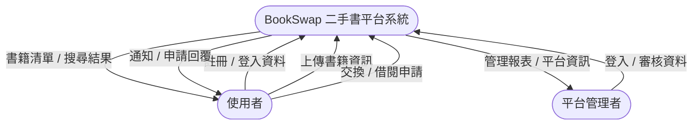
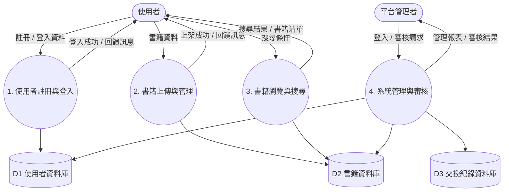
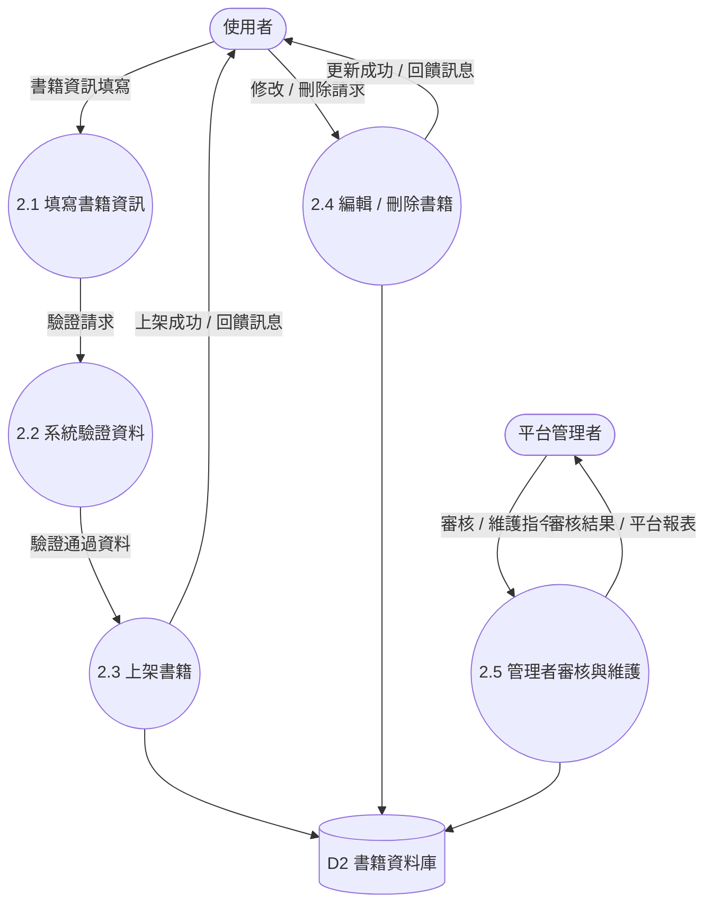

# 📘  二手書平台 DFD

```mermaid
flowchart TD
    %% 系統名稱
    System(["BookSwap 二手書平台系統"])

    %% 外部實體
    User(["使用者"])
    Admin(["平台管理者"])

    %% 資料流
    User -->|"註冊 / 登入資料"| System
    User -->|"上傳書籍資訊"| System
    User -->|"交換 / 借閱申請"| System
    System -->|"書籍清單 / 搜尋結果"| User
    System -->|"通知 / 申請回覆"| User

    Admin -->|"登入 / 審核資料"| System
    System -->|"管理報表 / 平台資訊"| Admin
```
---

## ⚙️ 二、DFD 圖 0（Level-0 Diagram）

```mermaid
flowchart TD
    %% 外部實體
    User(["使用者"])
    Admin(["平台管理者"])

    %% 處理程序
    P1((1. 使用者註冊與登入))
    P2((2. 書籍上傳與管理))
    P3((3. 書籍瀏覽與搜尋))
    P4((4. 系統管理與審核))

    %% 資料儲存
    D1[("D1 使用者資料庫")]
    D2[("D2 書籍資料庫")]
    D3[("D3 交換紀錄資料庫")]

    %% 資料流
    User -->|"註冊 / 登入資料"| P1
    P1 --> D1
    P1 -->|"登入成功 / 回饋訊息"| User

    User -->|"書籍資料"| P2
    P2 --> D2
    P2 -->|"上架成功 / 回饋訊息"| User

    User -->|"搜尋條件"| P3
    P3 --> D2
    P3 -->|"搜尋結果 / 書籍清單"| User

    Admin -->|"登入 / 審核請求"| P4
    P4 --> D1
    P4 --> D2
    P4 --> D3
    P4 -->|"管理報表 / 審核結果"| Admin
```
---

## 📘 三、DFD Level-1：書籍管理流程細化圖

```mermaid
flowchart TD
    %% 外部實體
    User(["使用者"])
    Admin(["平台管理者"])

    %% 處理程序
    P2_1((2.1 填寫書籍資訊))
    P2_2((2.2 系統驗證資料))
    P2_3((2.3 上架書籍))
    P2_4((2.4 編輯 / 刪除書籍))
    P2_5((2.5 管理者審核與維護))

    %% 資料儲存
    D2[("D2 書籍資料庫")]

    %% 資料流
    %% 使用者上傳
    User -->|"書籍資訊填寫"| P2_1
    P2_1 -->|"驗證請求"| P2_2
    P2_2 -->|"驗證通過資料"| P2_3
    P2_3 --> D2
    P2_3 -->|"上架成功 / 回饋訊息"| User

    %% 書籍維護
    User -->|"修改 / 刪除請求"| P2_4
    P2_4 --> D2
    P2_4 -->|"更新成功 / 回饋訊息"| User

    %% 系統管理者
    Admin -->|"審核 / 維護指令"| P2_5
    P2_5 --> D2
    P2_5 -->|"審核結果 / 平台報表"| Admin
```
