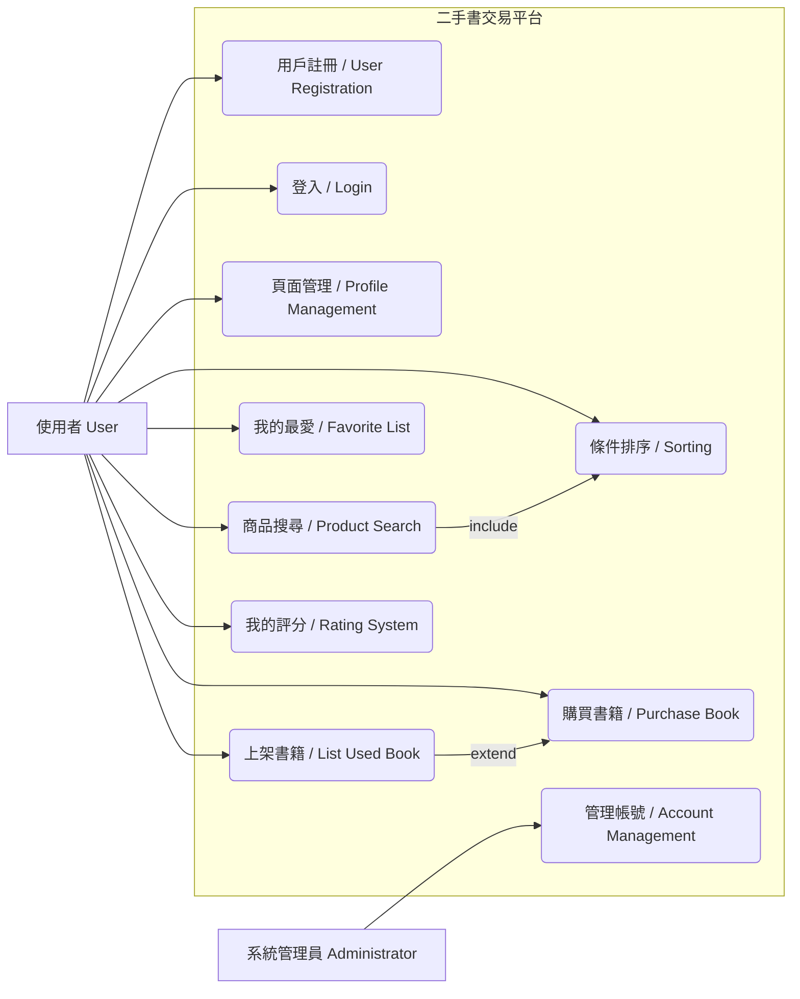

#  HW3：二手書交易平台

## 一、功能性需求 (Functional Requirements)

### 1. 用戶與帳號管理 (User & Account Management)

* 系統必須允許用戶創建帳號（**用戶註冊**）。
* 用戶需提供用戶名和密碼進行註冊。
* 系統應允許用戶新增個人簡介和聯絡方式（**頁面管理**）。

### 2. 商品搜索與收藏 (Product Search & Favorite)

* 系統必須提供搜索功能，允許用戶根據關鍵字搜索商品（**商品搜索**）。
* 搜索結果應顯示商品名稱、價格和縮圖。
* 系統應支持按價格等條件對搜索結果進行排序。
* 系統必須允許用戶將商品添加到「我的最愛」（**我的最愛**）。
* 用戶應能夠查看「我的最愛」中的內容，並能夠移除商品。

### 3. 商品上架與交易 (Product Listing & Transaction)

* 系統必須允許用戶新增販售書籍及其價格（**上架**）。

### 4. 評分機制 (Rating System)

* 系統必須允許用戶之間互相評分（**我的評分**）。

---

## 二、非功能性需求 (Non-functional Requirements)

### 1. 性能 (Performance)

* 搜索功能必須在 **3 秒** 內返回結果。

### 2. 安全性 (Security)

* 系統應實施防 **SQL 注入** 和 **跨站腳本攻擊**（XSS）的措施。

### 3. 可用性 (Usability & Accessibility)

* 系統界面應符合 **Web 內容無障礙指南 (WCAG) 2.1 級別 AA** 標準。
* 系統應支持主流瀏覽器，例如 **Chrome**。

### 4. 可擴展性 (Scalability)

* 系統架構應支持 **水平擴展**，以應對用戶量增長。

## 三、功能分解圖 (Functional Decomposition Diagram)

## 四、使用案例圖(Use Case Diagram)

---

## 五、案例說明：

### 賣家用例

| 使用案例名稱 |  上架商品 (List Product) |
|--------------|-----------------------------|
| 行動者       | Seller (賣家)               |
| 說明         | 賣家透過系統新增一本販售的書籍及其價格，並提供相關資訊。 |
| 完成動作     | 1. 賣家點擊「上架商品」按鈕。 2. 填寫書籍名稱、價格、描述、縮圖等。 3. 系統驗證並新增商品記錄。 |
| 替代方法     | 1. 資料驗證失敗時，系統提示錯誤並要求修正。 |
| 先決條件     | 賣家已登入系統並具有 Seller 身份。 |
| 後置條件     | 資料庫中新增一筆新的商品記錄，商品狀態為「販售中」。 |
| 假設         | 賣家擁有該商品的完整販售權利。 |

### 一般用戶案例 (瀏覽/搜索)

| 使用案例名稱 |搜索與查看結果 (Search & View Results) |
|--------------|--------------------------------------------------|
| 行動者       | User (一般用戶)                                  |
| 說明         | 用戶輸入關鍵字搜索商品，並能對結果進行查看和排序。 |
| 完成動作     | 1. 用戶輸入關鍵字並點擊搜索。 2. **(性能要求)** 系統在 3 秒內返回結果。 3. 系統顯示商品清單、價格和縮圖。 4. 用戶可選擇按價格等條件排序。 |
| 替代方法     | 1. 無匹配結果時，系統顯示「未找到相關商品」訊息。 |
| 先決條件     | 系統中已有商品上架。 |
| 後置條件     | 系統向用戶展示經過篩選和排序的商品清單。 |
| 假設         | 搜索功能已啟用且資料庫連線正常。 |

### 一般用戶案例 (收藏/互動)

| 使用案例名稱 |  收藏與評分 |
|--------------|----------------------|
| 行動者       | User (一般用戶)      |
| 說明         | 用戶可以將感興趣的商品加入收藏清單，並與其他用戶互相評分。 |
| 完成動作     | 1. 用戶點擊「加入我的最愛」。 2. 用戶在「我的最愛」中移除商品。 3. 用戶向其他用戶提交星級評分。 |
| 替代方法     | 1. 評分提交失敗時，系統提示重新操作。 |
| 先決條件     | 用戶已登入系統。 |
| 後置條件     | 收藏清單狀態更新，或評分記錄新增成功。 |
| 假設         | 系統支持用戶間的匿名或實名評分機制。 |

### 一般用戶案例 (購買書籍／線下交易)

| 使用案例名稱 | 購買書籍 (Purchase Book – Offline) |
|--------------|-----------------------------------|
| 行動者       | User (一般用戶)                    |
| 說明         | 用戶選擇想購買的書籍，並與賣家聯繫完成線下交易。 |
| 完成動作     | 1. 用戶在商品清單或商品詳細頁點擊「聯絡賣家」。 2. 系統提供賣家聯絡方式或內建訊息功能。 3. 用戶與賣家協商交易時間與地點。 4. 雙方完成線下交易後，用戶可在平台更新交易狀態或留言評價。 |
| 替代方法     | 1. 若聯絡賣家失敗，系統提示錯誤訊息並可重新操作。 2. 商品已被其他用戶預訂或售出，系統提示無法購買。 |
| 先決條件     | 用戶已登入系統，商品仍在上架狀態。 |
| 後置條件     | 系統更新交易狀態或評價，商品狀態可標記為已完成交易。 |
| 假設         | 用戶與賣家雙方遵守線下交易規範，平台僅提供訊息和狀態管理功能。 |

